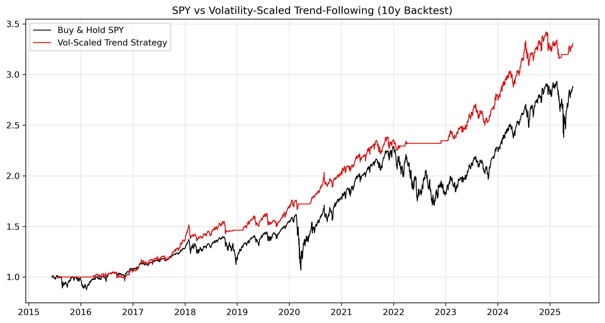

# 📈 Volatility-Scaled Trend-Following Strategy

This strategy dynamically adjusts position size based on market volatility and only takes long positions in the S&P 500 when the price is above its 200-day moving average. It aims to reduce drawdowns while maintaining exposure during strong uptrends — outperforming a traditional buy-and-hold approach over the last 10 years.

---

## 🚀 Strategy Summary

- 🟢 **Trend Filter**: Invest only when the S&P 500 is above its 200-day MA  
- 📉 **Volatility Scaling**: Reduce position size when markets are turbulent  
- 💼 **Objective**: Target 10% annualised volatility while avoiding large drawdowns

---

## 📊 Results

| Metric              | Value      |
|---------------------|------------|
| Strategy CAGR       |   12.68%   |
| Buy & Hold CAGR     |   11.14%   |
| Max Drawdown (Strat)|   10.35%   |
| Max Drawdown (Mkt)  |   33.92%   |
| Sharpe Ratio        |    1.26    |

> 📌 *Performance shown in chart below*

---

## 📈 Performance Chart

---

## 🧠 Insights

- Strategy avoided 2020 and 2022 drawdowns by exiting during trend breakdowns  
- Exposure was highest during calm uptrends (e.g., 2019, 2023)  
- Sharpe ratio improved significantly due to lower volatility and smoother equity curve

---

## ⚙️ Tech Stack

- Python  
- yFinance (data)  
- Pandas (processing)  
- Numpy (math)  
- Matplotlib (charts)  

---

## 📁 Files

- `strategy.ipynb` — Full working notebook  
- `chart.png` — Performance chart  

---

## 👤 Author

**Mannan Srivastava**  
First-year Data Science student, University of Bristol | GitHub: (https://github.com/MannanS18))
